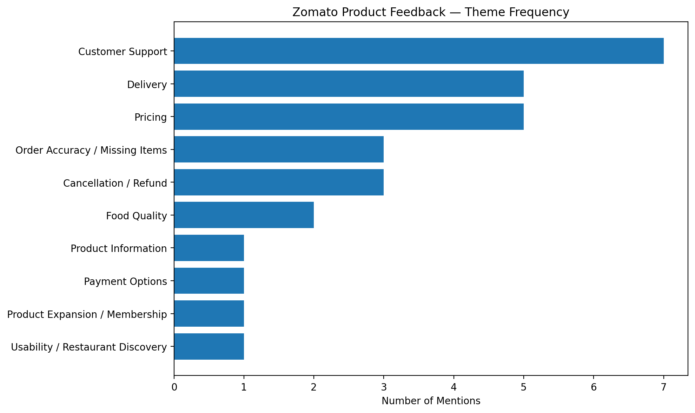

# Zomato Product Feedback Analysis

## Overview

> An AI-assisted analysis of customer reviews to identify recurring pain points and prioritize product improvements.
## Objective

The objective of this project is to transform unstructured customer reviews into structured insights that can support data-driven product decisions.

## Methodology

* Collected user reviews with different ratings.
* Categorized reviews into recurring themes such as delivery issues, payment problems, user interface issues, and customer support.
* Counted the number of reviews associated with each theme.
* Identified the major customer pain points.
* Suggested product features or improvements to address the identified issues.
* Prioritized recommendations based on the frequency and impact of customer problems.

## Analysis Framework

| Theme           | Pain Point                 | Suggested Improvement                 | Priority |
| --------------- | -------------------------- | ------------------------------------- | -------- |
| Delivery Issues | Late delivery              | Improve live delivery tracking        | High     |
| Payment Issues  | Payment failures           | Improve payment retry flow            | High     |
| UI Issues       | Difficulty finding options | Improve navigation and reorder access | Medium   |

> Note: The example themes above should be replaced with the actual results from the reviews analyzed in this project.

## Tools Used

* Claude AI
* Google Sheets
* Notion
* Data Analysis
* User Feedback Analysis

## Key Outcomes
## Analysis Visualization
* Converted unstructured customer feedback into structured themes

* Identified recurring customer pain points.
* Prioritized product improvement opportunities.
* Generated actionable recommendations based on user feedback.
* Applied AI-assisted analysis to support product decision-making.

## Skills Demonstrated

* Data Analysis
* Text Classification
* Customer Feedback Analysis
* Problem Identification
* Data Interpretation
* Product Prioritization
* AI-Assisted Analysis
* Data-Driven Decision Making

## Project Structure

## Project Files

- [Review Dataset](data/zomato_reviews.csv) — anonymized review dataset used for the analysis
- [Feedback Analysis](analysis/feedback_analysis.csv) — theme-level analysis and prioritization
- [Key Findings](outputs/key_findings.md) — major insights and product recommendations
- [Project Summary](PROJECT_SUMMARY.md) — methodology, analysis areas, and limitations
## Disclaimer

This project is intended for portfolio and educational purposes. The analysis is based on a limited sample of publicly available user reviews and does not represent the complete Zomato customer population.
